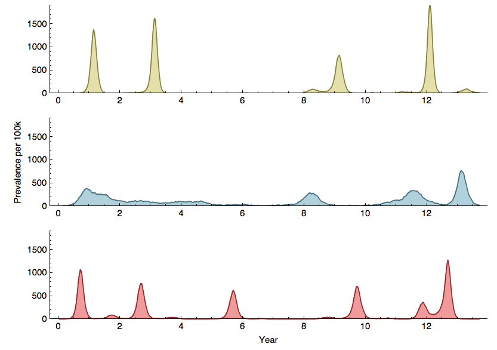
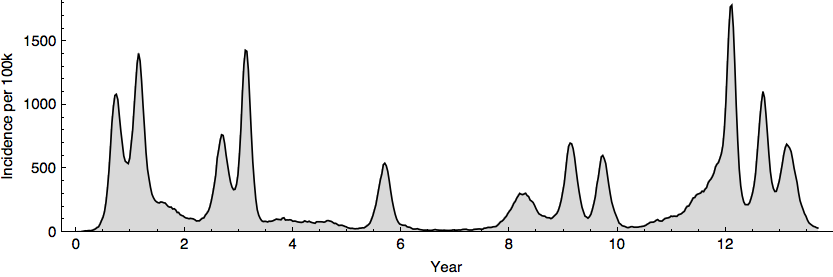
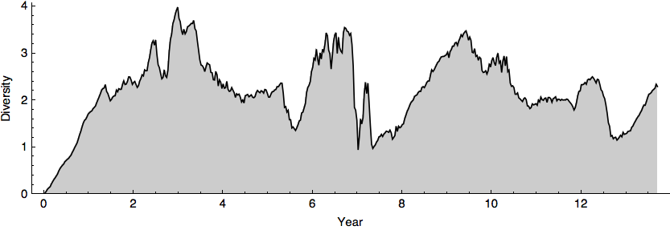
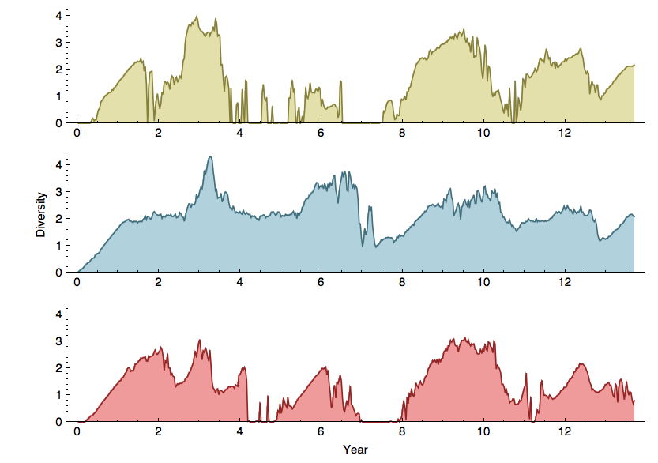
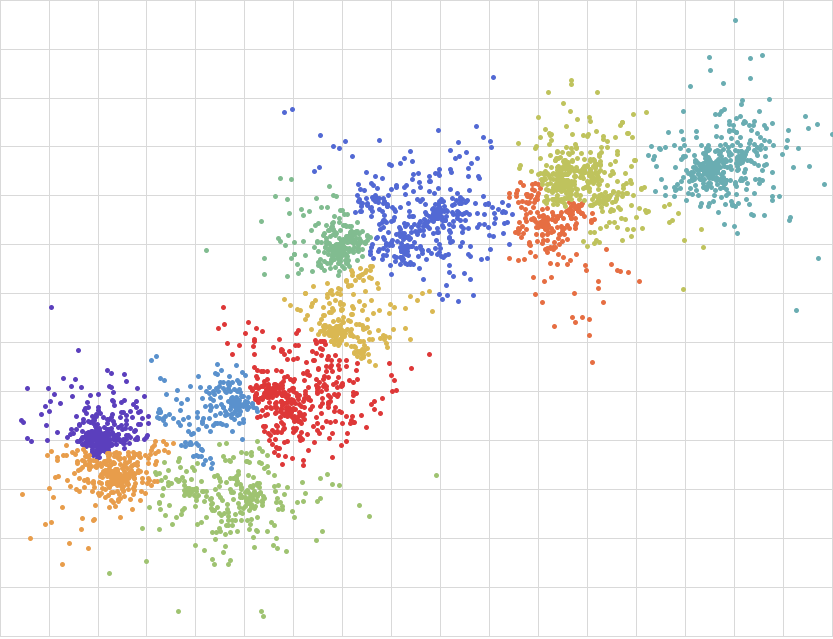
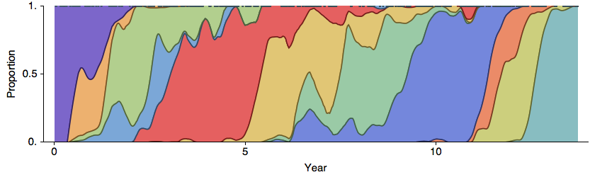
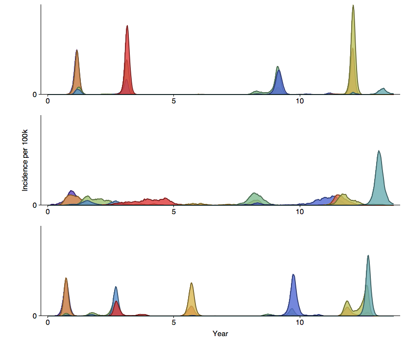
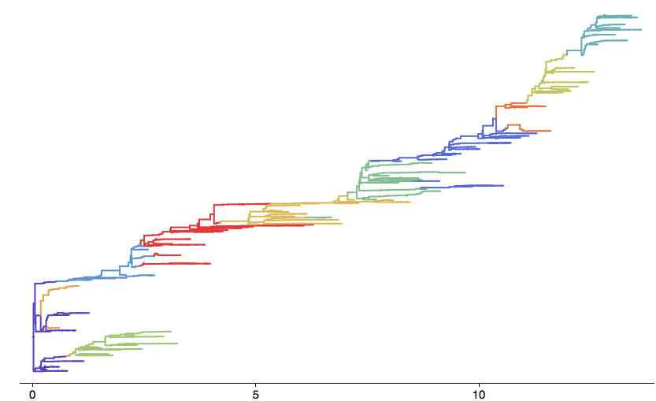
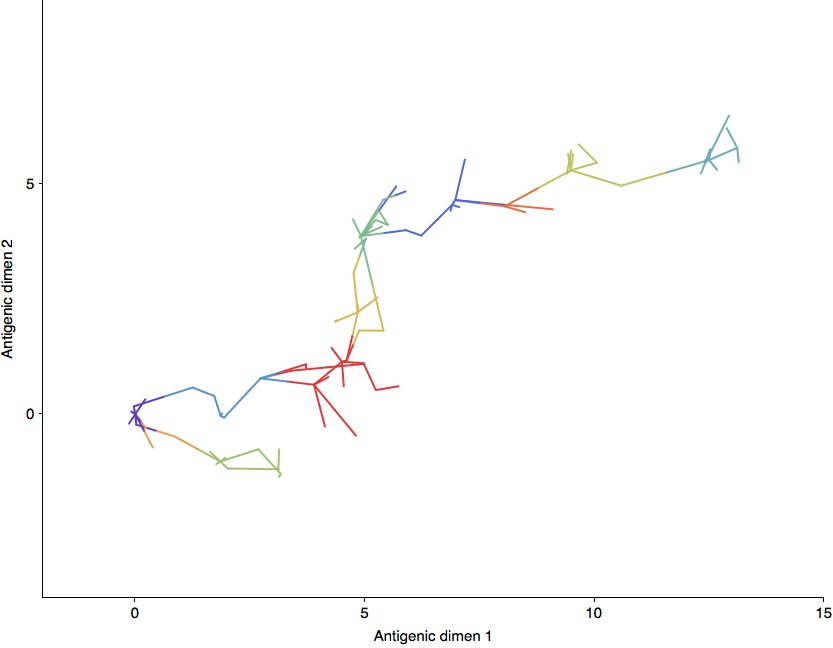

## Timeseries

### Prevalence

### Incidence

### Diversity

### TMRCA

## Virus samples

### Map

### Distance from origin

### Cluster turnover

### Incidence by cluster

## Tree

## Tree with clusters

## Tree with geography

## Time vs AG1

## AG1 vs AG2

